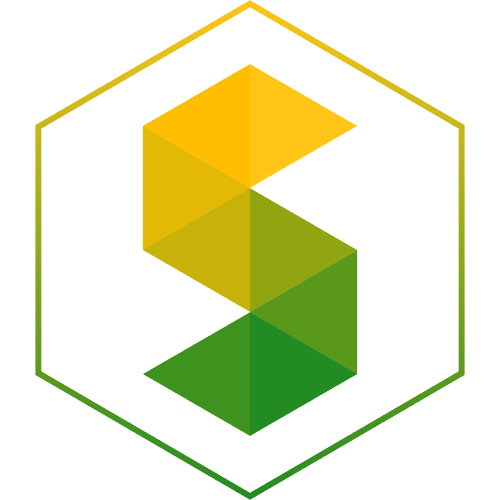

<!-- Don't delete it -->
<div name="readme-top"></div>

<!-- Organization Logo -->
<div align="center">
  
</div>

&nbsp;

<!-- Organization Name -->
<div align="center">

[](https://stability.nexus/)

</div>

<!-- Organization/Project Social Handles -->
<p align="center">
<!-- Telegram -->
<a href="https://t.me/StabilityNexus">
</a>
&nbsp;&nbsp;
<!-- X (formerly Twitter) -->
<a href="https://x.com/StabilityNexus">
</a>
&nbsp;&nbsp;
<!-- Discord -->
<a href="https://discord.gg/YzDKeEfWtS">
</a>
&nbsp;&nbsp;
<!-- Medium -->
<a href="https://news.stability.nexus/">
  </a>
&nbsp;&nbsp;
<!-- LinkedIn -->
<a href="https://linkedin.com/company/stability-nexus">
  </a>
&nbsp;&nbsp;
<!-- Youtube -->
<a href="https://www.youtube.com/@StabilityNexus">
  </a>
</p>

&nbsp;
<!-- Project core values and objective -->
<p align="center">
  <strong>
  The Stability Nexus is an ecosystem for people who care about a more stable world. <br />
  It is the location in semantic space for all about stability.
  </strong>
</p>

---

## **Why Stability Nexus?**

In a world facing challenges like climate change, financial instability, and social inequalities, the need for stability has never been greater. Stability Nexus aims to address these issues by providing a decentralized platform that fosters innovation, collaboration, and sustainable development.

## **Nearby Minted NFTs on Map**

Stability Nexus allows users to visualize nearby NFTs on an interactive map. This feature helps users explore environmentally friendly initiatives, track carbon credits, and participate in community-driven projects with transparency.

---

<!-- Table of Contents -->
<details>
  <summary>Table of Contents</summary>
  <ul>
    <li><a href="#getting-started"> &#x27E2; Getting Started</a></li>
    <li>
      <a href="#project-technologies"> &#x27E2; Project Technologies</a>
      <ul>
        <li><a href="#shadcn-ui-library-usage"> &#x27E2; shadcn UI Library Usage</a></li>
      </ul>
    </li>
    <li>
      <a href="#commands-to-run-before-pushing-code"> &#x27E2; Commands to run before pushing code</a>
      <ul>
        <li><a href="#first-command"> &#x27E2; First Command</a></li>
        <li><a href="#second-command"> &#x27E2; Second Command</a></li>
        <li><a href="#third-command"> &#x27E2; Third Command</a></li>
      </ul>
    </li>
    <li><a href="#updates"> &#x27E2; Updates</a></li>
    <li><a href="#learn-more"> &#x27E2; Learn More</a></li>
    <li><a href="#deploy-on-vercel"> &#x27E2; Deploy on Vercel</a></li>
    <li><a href="#fund"> &#x27E2; Fund Stability Nexus</a></li>
  </ul>
</details>

---

# 🌱 Tree Planting Protocol  

### **Revolutionizing Tree Plantation with Blockchain & NFTs**  

## 🏆 Why This Project Matters  

Deforestation and environmental degradation are among the biggest challenges of our time. Governments and organizations run plantation drives, but verifying their impact remains difficult. **Tree Planting Protocol** leverages **blockchain technology** to create a **verifiable and transparent record of tree plantations** worldwide.  

This mobile application allows users to **document tree plantations**, mint them as **NFTs**, and display them on a **public map** for verification. This not only encourages individuals to plant trees but also holds them accountable, ensuring long-term sustainability.  

## 🌍 Key Features  

### ✅ **Proof of Plantation via NFTs**  
- Users plant a tree and enter details such as **latitude, longitude, and species**.  
- A **blockchain-based NFT** is minted as proof of plantation.  
- NFTs ensure **tamper-proof verification** of real-world tree plantations.  

### 🗺️ **View Nearby Trees on a Map**  
- Users can **explore** already minted trees in their vicinity.  
- The map view promotes community engagement by making it easy to track plantation efforts.  

### 🔍 **Decentralized Verification**  
- Anyone can visit a location and **verify the existence** of a tree.  
- This **crowdsourced verification model** prevents false claims and ensures real-world impact.  

### 🪦 **Mark Trees as Dead**  
- If a tree dies due to natural or human causes, it can be **marked as dead** to keep records accurate.  
- This ensures transparency and **accountability in sustainability efforts**.  

## 🚀 Getting Started  

### **Installation**  
Clone the repository:  
```sh
git clone <repository-url>
```
Install dependencies:  
```sh
flutter pub get
```
Run the application:  
```sh
flutter run
```

## 🛠 **Tech Stack**  
- **Frontend**: Flutter, Dart  
- **Blockchain**: Solidity, Hardhat  
- **Storage**: Web3.Storage/Storacha (free decentralized IPFS storage)    

## 🌿 **Join the Movement**  
🌍 Every tree counts! By using the **Tree Planting Protocol**, you contribute to a transparent, verifiable, and sustainable future. Let's make the world greener—one tree at a time.  

<div align="right"><kbd><a href="#readme-top">↑ Back to top ↑</a></kbd></div>

---

<!-- Don't delete it -->
<!-- Funding Badge -->
<div align="center" name="fund">
<a href="https://docs.stability.nexus/about-us/fund-us"></a>
</div>